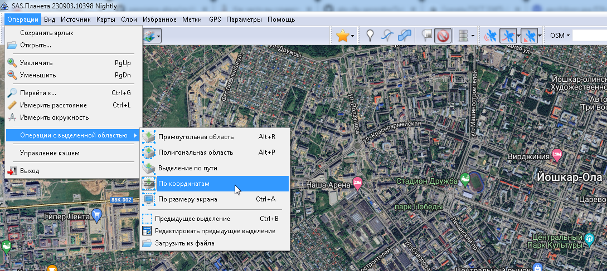
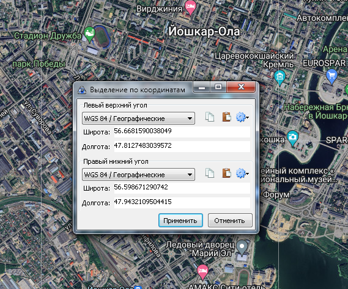
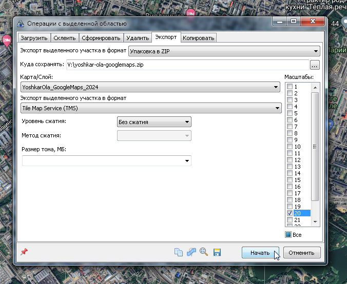

# Источники данных

В данном проекте используются следующие опорные точки Йошкар-Олы:
* `47.8127483039572,56.6681590038049,47.9432109504415,56.598671290742` - весь город с запасом
* `47.8292312174411,56.6056570359103,47.932228043613,56.6585299815102` - город по минимуму
* `56.6601552312463,47.8209433423879` - центр региона + 30 километров радиус
* `56.63109683633924,47.88093660864732` - наш центр города + 3 километра радиус

## Карта высот ALOS AW3D30
* Датасет: https://www.eorc.jaxa.jp/ALOS/en/aw3d30/data/index.htm
* Страница загрузки: https://www.eorc.jaxa.jp/ALOS/en/aw3d30/data/html_v2404/n050e030_n080e060.htm
* Тыкнуть на 56х47: https://www.eorc.jaxa.jp/ALOS/en/aw3d30/data/html_v2404/dl/download_v2404.htm?N055E045_N056E047
* Карта доступна после регистрации, логин - `ninila7297@kinsef.com`, пароль - название датасета
* Опционально делаем пост-процессинг и сносим домики: https://www.youtube.com/watch?v=LoF2nJbo-n8

## Карта высот ALOS Palsar

* Идем на поисковик https://search.asf.alaska.edu/
* Выбираем датасет "ALOS Palsar", появится предложение кликнуть на карте чтобы начать рисовать
* Зумим карту до Йошкар-Олы и кликаем где-то в сторонке, натягиваем прямоугольник на весь регион
* Забираем, к примеру, `ALPSRP186381130` внутри есть [ALPSRP186381130-RTC_HI_RES](https://datapool.asf.alaska.edu/RTC_HI_RES/A3/AP_18638_FBD_F1130_RT1.zip)
* Может попросить регистрацию для скачивания

## Карта высот Copernicus

* Идем https://spacedata.copernicus.eu/collections/copernicus-digital-elevation-model - тут инструкция
* Наш датасет: https://prism-dem-open.copernicus.eu/pd-desk-open-access/prismDownload/COP-DEM_GLO-90-DGED__2023_1/Copernicus_DSM_30_N56_00_E047_00.tar

## Карта высот ASTER

TODO: fixme

## Карта высот STRM1 (1 arc-second)

TODO: fixme

## Данные OSM

* Тырим весь приволжский федеральный округ: `wget https://download.geofabrik.de/russia/volga-fed-district-latest.osm.pbf`
* Отрезаем город Йошкар-Ола с некоторым запасом: `osmium extract -v --progress -s simple -b 47.8127483039572,56.6681590038049,47.9432109504415,56.598671290742 volga-fed-district-latest.osm.pbf -o yoshkar-ola-max.pbf`. Это нужно, чтобы было удобнее работать с файлом на 2 мегабайта, а не файлом на 650 мегабайт. Операция занимает некоторое время, 1.5 гигабайта оперативы и на выходе PBF-файл, как и на входе.
* Конвертируем PBF во что-то съедобное, например в текст: `osmium export -f text -o yoshkar-ola-max.txt -O -e -v --progress yoshkar-ola-max.pbf`
* Конвертируем PBF в привычный OSM.XML: `osmium cat -o yoshkar-ola-max.osm -O yoshkar-ola-max.pbf`

## Данные TMS (GoogleMaps, Bing, ESRI, OSM Mapnik и т.д.)

* Открываем SAS.Planet, исходные карты должны быть уже установлены
* Идем в Операции -> Операции с выделенной областью -> По координатам 
* Вводим координаты нужной области 
* Выбираем вкладку `Экспорт` и выставляем опции как на скриншоте: 
* Забираем получившийся `yoshkar-ola-googlemaps.zip`, внутри будут тайлики в формате TMS

## Данные о растительности (не обязательно)

* Тырим Landsat 8
* Sentinel 1-2

## Данные о домах

* https://xn--80aq1a.xn--p1aee.xn--p1ai/ (https://аис.фрт.рф/)
* Тыкнуть "открытые данные", потом "регионы"
* Тыкнуть "Реестр домов по Республике Марий Эл"

## Типовые серии домов

* https://www.kvmeter.ru/information/homes_series/

## Панорамы улиц Google StreetView / Яндекс STV-Шары / Mapillary

TODO: fixme

## Технические регламенты и стандарты по строительству дорог

В процессе рисования дорог могут возникать вопросы: верить спутниковой карте, или нарисованной? Как тут нарисовать надо, если непонятно, что видно на снимке?
Иногда в таких ситуациях могут помочь существующие регламенты. Читать это в общем-то для создания игры не надо, но если есть свободное время...

* [СП 34.13330.2012 (Автомобильные дороги)](https://files.stroyinf.ru/Data2/1/4293801/4293801871.pdf)
* [СНиП 2.05.02-85* (Автомобильные дороги)](https://files.stroyinf.ru/Data2/1/4294854/4294854746.pdf)
* [ГОСТ Р 50597-93 (Автомобильные дороги и улицы. Требования к эксплуатационному состоянию, допустимому по условиям обеспечения безопасности дорожного движения)](https://files.stroyinf.ru/Data2/1/4294852/4294852448.pdf)
* [Технический регламент Таможенного союза 014/2011 (Безопасность автомобильных дорог)](https://files.stroyinf.ru/Data2/1/4293800/4293800311.pdf)
* [ГОСТ Р 52399-2005 (Геометрические элементы автомобильных дорог)](https://files.stroyinf.ru/Data2/1/4293852/4293852672.pdf)
* [СНиП 2.07.01-89* (Градостроительство. Планировка и застройка городских и сельских поселений)](https://files.stroyinf.ru/Data2/1/4294854/4294854799.pdf)
* [СП 42.13330.2011 (Градостроительство. Планировка и застройка городских и сельских поселений)](https://files.stroyinf.ru/Data2/1/4293811/4293811097.pdf)
* [ГОСТ Р 50597-2017 (Дороги автомобильные и улицы. Требования к эксплуатационному состоянию, допустимому по условиям обеспечения безопасности дорожного движения. Методы контроля)](https://files.stroyinf.ru/Data2/1/4293743/4293743074.pdf)
* [ГОСТ 32757-2014 (Дороги автомобильные общего пользования. Временные технические средства организации дорожного движения. Классификация)](https://files.stroyinf.ru/Data2/1/4293759/4293759919.pdf)
* [ГОСТ 32758-2014 (Дороги автомобильные общего пользования. Временные технические средства организации дорожного движения. Технические требования и правила применения)](https://files.stroyinf.ru/Data2/1/4293761/4293761704.pdf)
* [ГОСТ 33475-2015 (Дороги автомобильные общего пользования. Геометрические элементы. Технические требования)](https://files.stroyinf.ru/Data2/1/4293752/4293752139.pdf)
* [ГОСТ 33175-2014 (Дороги автомобильные общего пользования. Горизонтальная освещенность от искусственного освещения. Методы контроля)](https://files.stroyinf.ru/Data2/1/4293764/4293764795.pdf)
* [ГОСТ Р 54305-2011 (Дороги автомобильные общего пользования. Горизонтальная освещенность от искусственного освещения. Технические требования)](https://files.stroyinf.ru/Data2/1/4293808/4293808687.pdf)
* [ГОСТ 33176-2014 (Дороги автомобильные общего пользования. Горизонтальная освещенность от искусственного освещения. Технические требования)](https://files.stroyinf.ru/Data2/1/4293764/4293764793.pdf)
* [ГОСТ 33144-2014 (Дороги автомобильные общего пользования. Дорожные зеркала. Технические требования)](https://files.stroyinf.ru/Data2/1/4293761/4293761879.pdf)
* [ГОСТ 32825-2014 (Дороги автомобильные общего пользования. Дорожные покрытия. Методы измерения геометрических размеров повреждений)](https://files.stroyinf.ru/Data2/1/4293766/4293766209.pdf)
* [ГОСТ 33386-2015 (Дороги автомобильные общего пользования. Дорожные светофоры. Методы контроля)](https://files.stroyinf.ru/Data2/1/4293752/4293752133.pdf)
* [ГОСТ 33385-2015 (Дороги автомобильные общего пользования. Дорожные светофоры. Технические требования)](https://files.stroyinf.ru/Data2/1/4293752/4293752134.pdf)
* [ГОСТ 32760-2014 (Дороги автомобильные общего пользования. Дорожные тумбы. Методы контроля)](https://files.stroyinf.ru/Data2/1/4293764/4293764729.pdf)
* [ГОСТ 32759-2014 (Дороги автомобильные общего пользования. Дорожные тумбы. Технические требования)](https://files.stroyinf.ru/Data2/1/4293764/4293764730.pdf)
* [ГОСТ 32946-2014 (Дороги автомобильные общего пользования. Знаки дорожные. Методы контроля)](https://files.stroyinf.ru/Data2/1/4293752/4293752120.pdf)
* [ГОСТ 32945-2014 (Дороги автомобильные общего пользования. Знаки дорожные. Технические требования)](https://files.stroyinf.ru/Data2/1/4293752/4293752121.pdf)
* [ГОСТ 32954-2014 (Дороги автомобильные общего пользования. Знаки переменной информации. Методы контроля)](https://files.stroyinf.ru/Data2/1/4293759/4293759708.pdf)
* [ГОСТ 32865-2014 (Дороги автомобильные общего пользования. Знаки переменной информации. Технические требования)](https://files.stroyinf.ru/Data2/1/4293759/4293759358.pdf)
* [ГОСТ 32849-2014 (Дороги автомобильные общего пользования. Изделия для дорожной разметки. Методы испытаний)](https://files.stroyinf.ru/Data2/1/4293766/4293766207.pdf)
* [ГОСТ 32848-2014 (Дороги автомобильные общего пользования. Изделия для дорожной разметки. Технические требования)](https://files.stroyinf.ru/Data2/1/4293766/4293766007.pdf)
* [ГОСТ Р 53171-2008 (Дороги автомобильные общего пользования. Изделия для дорожной разметки. Штучные формы. Методы контроля)](https://files.stroyinf.ru/Data2/1/4293829/4293829795.pdf)
* [ГОСТ Р 53170-2008 (Дороги автомобильные общего пользования. Изделия для дорожной разметки. Штучные формы. Технические требования)](https://files.stroyinf.ru/Data2/1/4293829/4293829796.pdf)
* [ГОСТ 32836-2014 (Дороги автомобильные общего пользования. Изыскания автомобильных дорог. Общие требования)](https://files.stroyinf.ru/Data2/1/4293764/4293764954.pdf)
* [ГОСТ 33179-2014 (Дороги автомобильные общего пользования. Изыскания мостов и путепроводов. Общие требования)](https://files.stroyinf.ru/Data2/1/4293764/4293764724.pdf)
* [ГОСТ 33154-2014 (Дороги автомобильные общего пользования. Изыскания тоннелей. Общие требования)](https://files.stroyinf.ru/Data2/1/4293761/4293761797.pdf)
* [ГОСТ 32964-2014 (Дороги автомобильные общего пользования. Искусственные неровности сборные. Технические требования. Методы контроля)](https://files.stroyinf.ru/Data2/1/4293759/4293759696.pdf)
* [ГОСТ 32962-2014 (Дороги автомобильные общего пользования. Камни бортовые. Методы контроля)](https://files.stroyinf.ru/Data2/1/4293759/4293759820.pdf)
* [ГОСТ 32961-2014 (Дороги автомобильные общего пользования. Камни бортовые. Технические требования)](https://files.stroyinf.ru/Data2/1/4293759/4293759821.pdf)
* [ГОСТ 33152-2014 (Дороги автомобильные общего пользования. Классификация тоннелей)](https://files.stroyinf.ru/Data2/1/4293761/4293761865.pdf)
* [ПНСТ 271-2018 (Дороги автомобильные общего пользования. Кольцевые пересечения. Правила проектирования)](https://files.stroyinf.ru/Data2/1/4293736/4293736846.pdf)
* [ГОСТ 32830-2014 (Дороги автомобильные общего пользования. Материалы для дорожной разметки. Технические требования)](https://files.stroyinf.ru/Data2/1/4293765/4293765930.pdf)
* [ГОСТ 33127-2014 (Дороги автомобильные общего пользования. Ограждения дорожные. Классификация)](https://files.stroyinf.ru/Data2/1/4293764/4293764656.pdf)
* [ГОСТ 33129-2014 (Дороги автомобильные общего пользования. Ограждения дорожные. Методы контроля)](https://files.stroyinf.ru/Data2/1/4293763/4293763530.pdf)
* [ГОСТ 33128-2014 (Дороги автомобильные общего пользования. Ограждения дорожные. Технические требования)](https://files.stroyinf.ru/Data2/1/4293764/4293764655.pdf)
* [ГОСТ 32948-2014 (Дороги автомобильные общего пользования. Опоры дорожных знаков. Технические требования)](https://files.stroyinf.ru/Data2/1/4293752/4293752118.pdf)
* [ГОСТ 32950-2014 (Дороги автомобильные общего пользования. Опоры металлические дорожных знаков. Методы контроля)](https://files.stroyinf.ru/Data2/1/4293752/4293752125.pdf)
* [ГОСТ 32949-2014 (Дороги автомобильные общего пользования. Опоры стационарного электрического освещения. Методы контроля)](https://files.stroyinf.ru/Data2/1/4293752/4293752117.pdf)
* [ГОСТ 32947-2014 (Дороги автомобильные общего пользования. Опоры стационарного электрического освещения. Технические требования)](https://files.stroyinf.ru/Data2/1/4293752/4293752119.pdf)
* [ГОСТ Р 58653-2019 (Дороги автомобильные общего пользования. Пересечения и примыкания. Технические требования)](https://files.stroyinf.ru/Data2/1/4293725/4293725783.pdf)
* [ГОСТ 32944-2014 (Дороги автомобильные общего пользования. Пешеходные переходы. Классификация. Общие требования)](https://files.stroyinf.ru/Data2/1/4293752/4293752122.pdf)
* [ГОСТ 33147-2014 (Дороги автомобильные общего пользования. Плиты дорожные железобетонные. Методы контроля)](https://files.stroyinf.ru/Data2/1/4293764/4293764691.pdf)
* [ГОСТ 32754-2014 (Дороги автомобильные общего пользования. Покрытия противоскольжения цветные. Методы контроля)](https://files.stroyinf.ru/Data2/1/4293768/4293768054.pdf)
* [ГОСТ 32753-2014 (Дороги автомобильные общего пользования. Покрытия противоскольжения цветные. Технические требования)](https://files.stroyinf.ru/Data2/1/4293768/4293768701.pdf)
* [ГОСТ 33025-2014 (Дороги автомобильные общего пользования. Полосы шумовые. Технические условия)](https://files.stroyinf.ru/Data2/1/4293764/4293764963.pdf)
* [ГОСТ 33100-2014 (Дороги автомобильные общего пользования. Правила проектирования автомобильных дорог)](https://files.stroyinf.ru/Data2/1/4293759/4293759695.pdf)
* [ГОСТ 33149-2014 (Дороги автомобильные общего пользования. Правила проектирования автомобильных дорог в сложных условиях)](https://files.stroyinf.ru/Data2/1/4293762/4293762175.pdf)
* [ГОСТ 33150-2014 (Дороги автомобильные общего пользования. Проектирование пешеходных и велосипедных дорожек. Общие требования)](https://files.stroyinf.ru/Data2/1/4293759/4293759694.pdf)
* [ГОСТ 33153-2014 (Дороги автомобильные общего пользования. Проектирование тоннелей. Общие требования)](https://files.stroyinf.ru/Data2/1/4293761/4293761845.pdf)
* [ГОСТ 32952-2014 (Дороги автомобильные общего пользования. Разметка дорожная. Методы контроля)](https://files.stroyinf.ru/Data2/1/4293764/4293764726.pdf)
* [ГОСТ 32953-2014 (Дороги автомобильные общего пользования. Разметка дорожная. Технические требования)](https://files.stroyinf.ru/Data2/1/4293764/4293764690.pdf)
* [ГОСТ 32839-2014 (Дороги автомобильные общего пользования. Световозвращатели дорожные. Методы контроля)](https://files.stroyinf.ru/Data2/1/4293765/4293765501.pdf)
* [ГОСТ 32866-2014 (Дороги автомобильные общего пользования. Световозвращатели дорожные. Технические требования)](https://files.stroyinf.ru/Data2/1/4293765/4293765500.pdf)
* [ГОСТ 32844-2014 (Дороги автомобильные общего пользования. Столбики сигнальные дорожные. Методы контроля)](https://files.stroyinf.ru/Data2/1/4293764/4293764688.pdf)
* [ГОСТ 32843-2014 (Дороги автомобильные общего пользования. Столбики сигнальные дорожные. Технические требования)](https://files.stroyinf.ru/Data2/1/4293764/4293764689.pdf)
* [ГОСТ 33382-2015 (Дороги автомобильные общего пользования. Техническая классификация)](https://files.stroyinf.ru/Data2/1/4293752/4293752138.pdf)
* [ПНСТ 270-2018 (Дороги автомобильные общего пользования. Транспортные развязки. Правила проектирования)](https://files.stroyinf.ru/Data2/1/4293736/4293736847.pdf)
* [ГОСТ 33062-2014 (Дороги автомобильные общего пользования. Требования к размещению объектов дорожного и придорожного сервиса)](https://files.stroyinf.ru/Data2/1/4293759/4293759818.pdf)
* [ГОСТ 32840-2014 (Дороги автомобильные общего пользования. Экраны противоослепляющие. Методы контроля)](https://files.stroyinf.ru/Data2/1/4293764/4293764967.pdf)
* [ГОСТ 32838-2014 (Дороги автомобильные общего пользования. Экраны противоослепляющие. Технические требования)](https://files.stroyinf.ru/Data2/1/4293764/4293764728.pdf)
* [ГОСТ 32846-2014 (Дороги автомобильные общего пользования. Элементы обустройства. Классификация)](https://files.stroyinf.ru/Data2/1/4293764/4293764964.pdf)
* [ГОСТ Р 52765-2007 (Дороги автомобильные общего пользования. Элементы обустройства. Классификация)](https://files.stroyinf.ru/Data2/1/4293836/4293836395.pdf)
* [ГОСТ Р 52767-2007 (Дороги автомобильные общего пользования. Элементы обустройства. Методы определения параметров)](https://files.stroyinf.ru/Data2/1/4293836/4293836380.pdf)
* [ГОСТ Р 52766-2007 (Дороги автомобильные общего пользования. Элементы обустройства. Общие требования)](https://files.stroyinf.ru/Data2/1/4293835/4293835927.pdf)
* [ГОСТ 33151-2014 (Дороги автомобильные общего пользования. Элементы обустройства. Технические требования. Правила применения)](https://files.stroyinf.ru/Data2/1/4293761/4293761869.pdf)
* [ГОСТ Р 50577-93 (Знаки государственные регистрационные транспортных средств. Типы и основные размеры. Технические требования)](https://files.stroyinf.ru/Data2/1/4294819/4294819496.pdf)
* [ГОСТ 10807-78 (Знаки дорожные. Общие технические условия)](https://files.stroyinf.ru/Data2/1/4294849/4294849191.pdf)
* [ГОСТ Р 52398-2005 (Классификация автомобильных дорог. Основные параметры и требования)](https://files.stroyinf.ru/Data2/1/4293852/4293852673.pdf)
* [ГОСТ 3634-99 (Люки смотровых колодцев и дождеприемники ливнесточных колодцев. Технические условия)](https://files.stroyinf.ru/Data2/1/4294849/4294849049.pdf)
* [ГОСТ 3634-89 (Люки чугунные для смотровых колодцев. Технические условия)](https://files.stroyinf.ru/Data2/1/4294853/4294853505.pdf)
* [ОДМ 218.2.020-2012 (Методические рекомендации по оценке пропускной способности автомобильных дорог)](https://files.stroyinf.ru/Data2/1/4293787/4293787897.pdf)
* [Федеральный закон 257-ФЗ (Об автомобильных дорогах и о дорожной деятельности в Российской Федерации и о внесении изменений в отдельные законодательные акты Российской Федерации)](https://files.stroyinf.ru/Data2/1/4293836/4293836441.pdf)
* [ГОСТ 26804-86 (Ограждения дорожные металлические барьерного типа. Технические условия)](https://files.stroyinf.ru/Data2/1/4294853/4294853516.pdf)
* [ГОСТ 25458-82 (Опоры деревянные дорожных знаков. Технические условия)](https://files.stroyinf.ru/Data2/1/4294853/4294853243.pdf)
* [ГОСТ 25459-82 (Опоры железобетонные дорожных знаков. Технические условия)](https://files.stroyinf.ru/Data2/1/4294853/4294853319.pdf)
* [ГОСТ Р 55844-2013 (Освещение наружное утилитарное дорог и пешеходных зон. Нормы)](https://files.stroyinf.ru/Data2/1/4293774/4293774050.pdf)
* [ГОСТ Р 55706-2013 (Освещение наружное утилитарное. Классификация и нормы)](https://files.stroyinf.ru/Data2/1/4293774/4293774889.pdf)
* [ГОСТ Р 54350-2015 (Приборы осветительные. Светотехнические требования и методы испытаний)](https://files.stroyinf.ru/Data2/1/4293763/4293763496.pdf)
* [ГОСТ 23616-79 (Система обеспечения точности геометрических параметров в строительстве. Контроль точности)](https://files.stroyinf.ru/Data2/1/4294853/4294853529.pdf)
* [ГОСТ 26433.0-85 (Система обеспечения точности геометрических параметров в строительстве. Правила выполнения измерений. Общие положения)](https://files.stroyinf.ru/Data2/1/4294853/4294853528.pdf)
* [ГОСТ 26433.1-89 (Система обеспечения точности геометрических параметров в строительстве. Правила выполнения измерений. Элементы заводского изготовления)](https://files.stroyinf.ru/Data2/1/4294853/4294853527.pdf)
* [ГОСТ 21779-82 (Система обеспечения точности геометрических параметров в строительстве. Технологические допуски)](https://files.stroyinf.ru/Data2/1/4294853/4294853532.pdf)
* [ГОСТ Р 51582-2000 (Технические средства организации дорожного движения. Знаки дорожные "Пункт контроля международных автомобильных перевозок" и "Пост дорожно-патрульной службы". Общие технические требования. Правила применения)](https://files.stroyinf.ru/Data2/1/4294818/4294818549.pdf)
* [ГОСТ Р 52290-2004 (Технические средства организации дорожного движения. Знаки дорожные. Общие технические требования)](https://files.stroyinf.ru/Data2/1/4293854/4293854148.pdf)
* [ГОСТ Р 52605-2006 (Технические средства организации дорожного движения. Искусственные неровности. Общие технические требования. Правила применения)](https://files.stroyinf.ru/Data2/1/4293846/4293846588.pdf)
* [ГОСТ 31970-2012 (Технические средства организации дорожного движения. Методы испытаний дорожных ограждений)](https://files.stroyinf.ru/Data2/1/4293776/4293776284.pdf)
* [ГОСТ 31994-2013 (Технические средства организации дорожного движения. Ограждения дорожные удерживающие боковые для автомобилей. Общие технические требования)](https://files.stroyinf.ru/Data2/1/4293773/4293773812.pdf)
* [ГОСТ 23457-86 (Технические средства организации дорожного движения. Правила применения)](https://files.stroyinf.ru/Data2/1/4294845/4294845490.pdf)
* [ГОСТ Р 52289-2019 (Технические средства организации дорожного движения. Правила применения дорожных знаков, разметки, светофоров, дорожных ограждений и направляющих устройств)](https://files.stroyinf.ru/Data2/1/4293854/4293854149.pdf)
* [ГОСТ Р 51256-2011 (Технические средства организации дорожного движения. Разметка дорожная. Классификация. Технические требования)](https://files.stroyinf.ru/Data2/1/4293793/4293793632.pdf)
* [ГОСТ Р 51256-2018 (Технические средства организации дорожного движения. Разметка дорожная. Классификация. Технические требования)](https://files.stroyinf.ru/Data2/1/4293738/4293738964.pdf)
* [ГОСТ Р 54809-2011 (Технические средства организации дорожного движения. Разметка дорожная. Методы контроля)](https://files.stroyinf.ru/Data2/1/4293794/4293794502.pdf)
* [ГОСТ Р 51256-99 (Технические средства организации дорожного движения. Разметка дорожная. Типы и основные параметры. Общие технические требования)](https://files.stroyinf.ru/Data2/1/4294850/4294850253.pdf)
* [ГОСТ Р 52282-2004 (Технические средства организации дорожного движения. Светофоры дорожные. Типы и основные параметры. Общие технические требования. Методы испытаний)](https://files.stroyinf.ru/Data2/1/4293854/4293854150.pdf)
