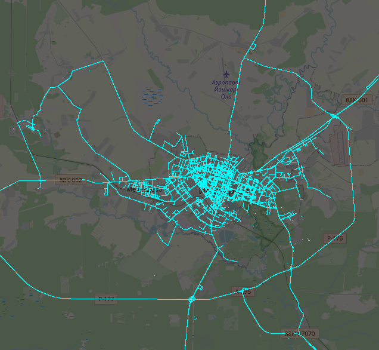

# С чего начать? Что мне здесь можно делать?

Этот проект максимально свободный и открытый. Это значит, что трудиться над задачами может каждый, причем в меру своего интереса или испорченности.

Вот 2 отправные точки, с которых можно начать:

* Создать ISSUE, где сказать что-то вроде "хочу работать, умею XXX, использую YYY", может быть мы что-нибудь придумаем!
* Проявить инициативу и создать ISSUE вида "хочу написать парсер гугла" и мы попробуем написать техзадание.

В принципе, так как проект свободный и открытый, то начинать можно и без технического задания, просто потом может уйти много времени на адаптацию твоей работы под нужды проекта.

# Пример краткого технического задания (ТЗ)

> Если кто-то умеет, то напишите за меня парсер Mapillary: это хранилище достаточно всратых панорам, но их там много, а самое главное - это панорамы не только с улиц, но и из дворов, где самая мякотка отечественной урбанистики. Сады из шин, спящие бомжи и заросли причудливых форм - это именно часть дворов, которую сложно увидеть на официальных панорамах гугла или яндекса.
>
> Что нужно сделать:
> * Каким-то образом найти координаты всех панорам (зелененькие линии с точками, по которым можно кликнуть).
> * Вытащить из этих точек координаты (широту, долготу) и ориентацию (азимут).
> * Вытащить сами картинки (обычно одна картинка разбита на 9 или 16 тайликов).
> * Сложить в sqlite3 базу как координаты, так и сами картинки и промежуточные данные (в общем, все что качалось, надо сложить в базу, чтобы ничего не терялось).
> * Если умеете, написать к этому вьюер, чтобы в оффлайне можно было покликать и посмотреть фоточки
>
> Это не то, что слишком нужно, но если это кто-то сделает, то это будет очень полезно для дальнейшего проекта. Да и не одному же мне тянуть проект вниз и быть слабым звеном?

Предполагается, что исполнитель все это поймет, а данные для структуры sqlite придумает сам или спросит отдельно при переписке

# Развернутое техзадание

В приватной беседе можно и нужно задавать вопросы о том, как выполнить те или иные задачи. Стесняться не стоит, но и тупые вопросы задавать тоже не следует.

Итак, как нам найти координаты всех панорам? Я не знаю, это и есть само задание. Возможно, можно найти какие-то API, а потом через эти API получить искомое. Возможно следует открыть инспектор
сети и посмотреть, какие запросы делает браузер, после чего воспользовавшись дедукцией, совершить задуманное. Иногда, когда начинаешь делать задание, может выяснится, что задание составлено
некорректно: к примеру, в Мапиллари все панорамы (картинки) разложены по Сиквенсам и на самом деле первым делом надо найти названия этих самых Сиквенсов, а уже внутри этих Сиквенсов лежат коодинаты
и азимут этих картинок. Т.е. сначала ищем Сиквенсы, а уже потом координаты.

При скачивании картинок, может в голову придти замечательная идея склеить эти самые картинки. Идея здравая, ведь работать с целыми картинками может быть удобнее. Но эта идея и крайне плохая:
при пережатии картинок в любом случае мы получим чуть более плохое качество, а исходный размер картинок может значительно вырасти. Поэтому не занимаемся самодеятельностью и не пытаемся
изменять контент, сохраняем все данные максимально без модификации.

Так как картинок будет очень много, то возникает вопрос: как их хранить? В процессе разработки вполне можно хранить картинки на файловой системе, примерно с такой иерархией:
```
pano_grabber/mapillary/id_8h76tgf76gb8e4t5rf65ndkscnumnvz97w0748h6/zoom0/15x10.jpg
pano_grabber/mapillary/id_8h76tgf76gb8e4t5rf65ndkscnumnvz97w0748h6/zoom1/33x22.jpg
pano_grabber/mapillary/id_8h76tgf76gb8e4t5rf65ndkscnumnvz97w0748h6/zoom2/11x33.jpg
```
Но картинок будет очень много, управлять ими будет неудобно и главное - на диске они будут занимать слишком много места, так как сами картинки маленькие. Решение - засунуть картинки в какой-то контейнер.
Конечно, можно самому разработать контейнер, засунуть картинки в файловый архив (zip-файл) или же, чтобы обеспечить простоту использования - воспользоваться базой данный sqlite. Структура таблиц в
этой базе должна быть максимально простой и содержать только минимальный набор поле, такие как:

```
CREATE TABLE IF NOT EXISTS tiles (
pano_id VARCHAR(50) NOT NULL,
x INTEGER NOT NULL,
y INTEGER NOT NULL,
z INTEGER NOT NULL,
tile BLOB,
constraint PK_TB primary key (pano_id,x,y,z))
```
Это пример таблицы для хранения сферических панорам Google StreetView. В нашем случае у нас плоские фотографии, потому нам надо добавить поле "тип изображения" и "азимут снимка", чтобы не потерять ничего.

А собственно, что мы скачали? В процессе работы имеет смысл писать различные тесты и визуализаторы данных. Например, можно просто взять координаты (широту и долготу) каждого снимка и разместить на карте.
Как? Да не знаю, как тебе удобнее! Можно взять lefleat.js и сделать карту в браузере, можно сделать KML-файл и подгрузить его в Google Earth или SAS.Planet, а можно просто сгенерировать PNG-картинку с кучей точек.
Лично я генерировал такие картинки:



Здесь можно увидеть, что местами на дорогах должно быть побольше точек, но в целом все линии плавные, весь город покрыт достаточно однородно и в целом все выглядит правдоподобно. Значит мы хорошо поработали!
Если же дороги прерываются, половина города не покрыта и слишком много случайных точек - значит что-то с нашим датасетом не так - надо его чинить и писать новые скрипты, которые исправят в нем ошибки.
А потом скрипты, которые исправят ошибки после предыдущего скрипта. И так до тех пор, пока не будет похоже на правду. Правду можно зачастую увидеть на оригинальном сайте.

Если ты умеешь в 3D-графику, то было бы неплохо все это визуализировать в виде красивых дорог и фотографий, парящих в воздухе. Своего рода, это еще один тест, но на сей раз на полноту данных.
К примеру, мы вдруг заметили, что все наши картинки смотрят в одну сторону - значит как минимум мы забыли спарсить азимут и наши данные не полноценны. В этот момент было бы неплохо залезть в уже сохраненные данные и перечитать голые JSON-файлы прямо из базы, а не выкачивать миллионы картинок заново.

# Где спросить подробности

* В дискорд-канале: https://discord.gg/pbSTvva4tG
* Можно пообщаться голосом в Mumble: mumble://soobbotnyayakonfyeryentseeya.anon.fm
