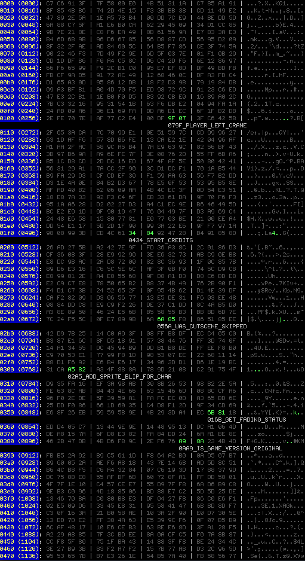
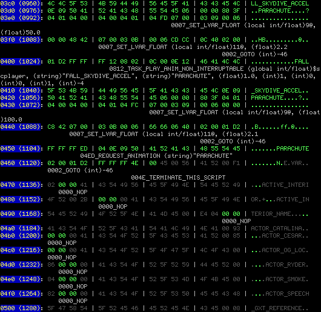

# Лирическая часть

Ну вот так получилось, что однажды я вкатился в это ваше GTA-CLEO-погромирование. Погромировать было сложно, больно, особенно без документации и нормальных туторов. Туторы от школьников были, но толку от них было мало.

Чтобы понять, что и как вообще работает, чтобы получить какой-то гайд как погромировать эту вашу ГэТэАшечку, было скачано около 2000 cleo-скриптов с разным говном, полезным и не очень, чтобы потом их декомпилировать и посмотреть, как люди, которые поумнее меня, погромируют все это говно.

Среди этого говна был некий скрипт FLY.cs, позволяющий персонажу летать. Мод был настолько хороший, что мне конечно же сразу же захотелось это декомпилировать. И я получил отлуп от SA3. Тогда же я узнал, что школьники "защищают свою интеллектуальную собственность", а значит мне не стоит рыпаться.

И вот прошли годы, я деградировал и вернулся к вопросу: как декомпилировать это говно? Скачал свежий SB4, но и тут меня постигла неудача. Я даже записал видео с сорт-оф багрепортом и отпостил его сюда: https://discord.com/channels/911487285990674473/911488143629357087/1413726012084322386 от 6 сентября, но @Seemann так и не подтер мою попку, я остался плакать.

И вот, на вершине депрессии, я за каким-то лешим решил декомпилировать этот "волшебный скрипт". И отсюда началось мое новое приключение по написанию абсолютно бесполезного набора тулов. Ну как бесполезного - я теперь немного понимаю как работает СанниБилдер.


# Техническая часть

Раз Саннибилдер не умеет такое распаковывать, сыпит ошибками, то надо брать все в свои руки. Взял базу вроде бы от SB (точнее то, что идет в комплекте с CLEO5) и попробовал примитивное наивное чтение байткода. К моему удивлению, все получилось гораздо лучше, чем я вообще мог думать.

Однако не все декодировалось так, как мне того бы хотелось. Некоторые опкоды имели "странный" размер. Например, количество "входящих" и "исходящих" параметров могло просто не совпадать с указанным количеством аргументов.

Среди прочего был найден sc3compiler (наиболее лучшая база, но пару опкодов пришлось изменить), вики-страничка на gtamods и исходники для декомпилятора в Гидре. Местами все эти базы разнились.

Кроме того, у меня были данные о типах, но им тоже приходилось только верить. В лучшем случае, я знал, какой параметр "входной", а какой "выходной".

Читая же исходник, можно было увидеть `CRunningScript::ReadTextLabelFromScript` и понять, что в конкретном опкоде хотят именно строчку, причем была известна даже длина в символах, чего ни одна из существующих баз мне дать не могла

Ну и я решил сделать свою базу, которая бы знала, какие параметры следует ожидать, а какие нет.

Для примера, давайте возьмем опкод "CREATE_FX_SYSTEM_ON_CHAR", его нету ни на Вики от ГТА-модс, ни в Гидре, но он есть в CLEO5 и SC3. Для этого параметра я построил строчку "s32i5o1", которая значит:
```
s32 - строка до 32 байт
i5 - 5 входных параметров без типа
o1 - 1 выходной параметр без типа.
```

Всего получились такие типы:

```
Legend:
i - input values, mostly ints or offsets
o - output values (2, 3, 7, 8)
p - input pointer to var (no immediate value) (2, A, 0x10 / 3, b, 0x11 / 7, C, 0x12 / 8, D, 0x13)
g - input pointer to global variable (2, 7 and "int16")
b - input byte (maybe flag or var)
s - input string values, number=max string length (9..20)
v - vararg (enables 0 type)
```

Для этого было написано несколько утилит, а потом глазками и ручками, прочесаны опкоды в IDA. Много ручной работы. Не уверен в корректности некоторых опкодов, которые я сделал, например, в `STRING_CAT8`/`STRING_CAT16`.

Моей главной целью было сделать такой дизассемблер, чтобы ему можно было на вход подать полностью обезображенный байткод, а то и вообще рандом, а он нашел только работающий код или хотя бы что-то на него похожее. Для этого мне нужно как можно больше информации о типах. И вот потому я и начал делать свою собственную базу.

Вот тут на картинке я подаю на вход рандом, но мой дизассемблер находит только единичные мелкие команды, которые я планирую в будущем убрать через эвристики. И было бы клево, добавить эти эвристики в Саннибилдер.



Например, чуть позже, я хочу собрать статистику по используемым типам операндов и на это можно будет полагаться при дизассемблинге, чтобы убирать "маловероятные" опкоды.

Но главное, я хочу пойти дальше и посчитать цепи Маркова, чтобы можно было отсеивать маловероятные последовательности опкодов, такие как NOP NOP NOP.

Может быть сделаю страничку со всеми опкодами, типами, алиасами и статистикой. Такую, какую хотел бы видеть и какую я так и не нашел.

# Срыв покровов

А ларчик с `FLY.cs` просто открывался - в конце файла был просто мусор, который сводил с ума Саннибилдер и он сыпал кучей ошибок, которые я и показал на видео. Достаточно было этот "хвост" отрезать и все отлично открылось.

Но чтобы до этого дойти, понадобилось затратить массу усилий, написать массу говнокода и познакомиться с байткодом. Когда я запустил свой дизассемблер, то просто увидел, что с какого-то момента пошел мусор. Убрал его и все получилось.




Так что теперь, когда великая тайна открыта и нужность этого под-проекта под сомнением, я не знаю что делать дальше.

Может быть разве что напишу какой-то гайд, ведь я сам теперь лучше понимаю, как работает байткод и как работает Саннибилдер.

