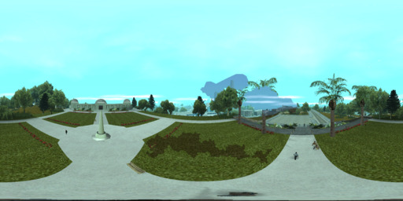
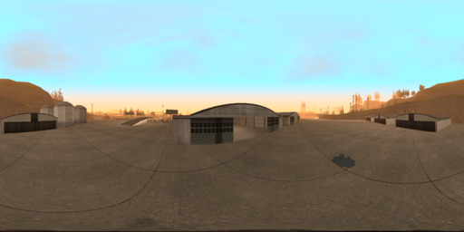
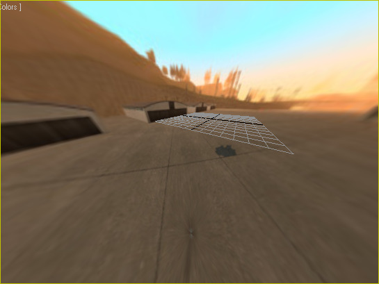

# Просмотрщик панорам внутри игры GTA San Andreas

## Что нужно сделать?

Хочу чтобы вы зделоли мод, суть токова: в произвольном месте игры можно нажать хоткей и вокруг персонажа появляется сфера. У сферы свои координаты, близкие координатам персонажа, но не равные им. Грубо говоря, есть база сфер и надо найти ближайшую. Опционально, телепортнуться в центр этой сферы. Опционально поебать камеру так, чтобы она смотрела из центра этой сферы. На сферу натянуть текстурку, которая лежит в sqlite (не обязательно, можно сделать IPC хоть по http и взять ее от другого сервиса). Текстура представляет собой панораму

Желаемое управление:

* Хоткей для включения/выключения панорамы рядом с текущими координатами
* Хоткей для изменения размеров панорамы (1, 10, 50, 100, 200 метров)
* Хоткей чтобы показать соседние панорамы (вообще не приоритетно, но если не лень), чтобы к ним можно было придти в игре

## Важность работы

Не то, чтобы это было очень как нужно и черезвычайно как важно, но было бы полезно для моей шизы и проекта GTA: Йошкар-Ола в целом.

## Тестовые данные

Чтобы поиграться с текстурами и координатами, ножно использовать эти картинки (или любые другие со сферической разверткой). На качество (разрешение) можно не обращать внимания, я специально сделал картинки мелкими, чтобы не захламлять гитхаб.

### Картинка 1

Координаты в игре: 1192x-2037x69

### Картинка 2

Координаты в игре: -1436x-589x14

На этой картинке есть промежутки между плиткой. Внутри игры, при натягивании на сферу, эти линии должны выглядеть прямыми. Пример из 3dsmax:

## Интерфейс связи с хранилищем панорам

Координаты могу отдавать по http, через файлик, через com/ole. Ну или напрямую можешь открыть sqlite-базу и читать оттуда селектом.

## Условия

Само собой, хочу все попенсорсно, можно на гитхабе, шобы потом возить всяких любителей вирустотала фейсом об тейбл.
